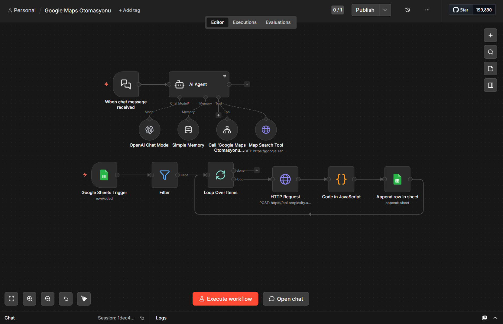
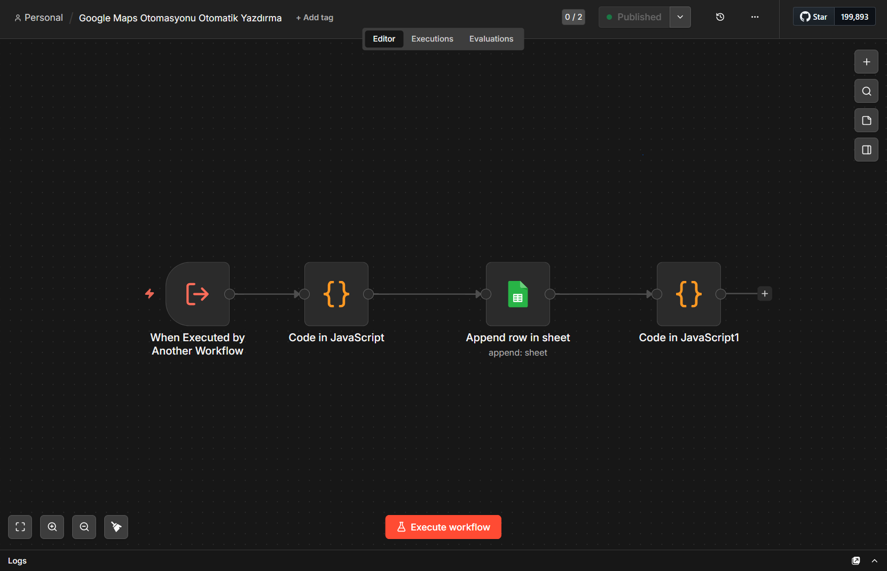

# 🗺️ Google Maps İşletme Veri Madenciliği Otomasyonu (n8n + AI)

Bu proje, kullanıcının doğal dildeki komutlarını analiz ederek Google Maps üzerinden işletme verilerini (adres, telefon, puan, web sitesi vb.) otomatik olarak toplayan ve **2 ayrı iş akışı (Workflow)** ile modüler bir yapıda Google Sheets'e kaydeden bir n8n otomasyonudur.

## 🧠 Sistem Mimarisi (Nasıl Çalışır?)

Sistem, "Modüler" (ayrıştırılmış) bir yaklaşımla 2 ayrı workflow olarak tasarlanmıştır:

### 🔵 **Workflow 1: Ana Sistem (AI Ajanı & Arama Motoru)**
Bu workflow, kullanıcı ile doğrudan etkileşime girer ve Google Maps aramasını yönetir.
1. **Chat Tetikleyici:** Kullanıcı chat'e "Denizli'deki kebapçıları getir" gibi bir komut yazar.
2. **AI Agent & OpenAI Model:** Komutu analiz eder, şehir ve kategoriyi çıkarır.
3. **Map Search Tool:** `google.serper.dev` API'sini kullanarak Google Maps'te arama yapar.
4. **Alt Workflow Çağrısı:** Bulunan her işletme için Workflow 2'yi tetikleyerek veriyi gönderir.

### 🔴 **Workflow 2: Yazdırma Servisi (Veri İşleme & Depolama)**
Bu workflow, Workflow 1 tarafından çağrılır; veriyi temizler, zenginleştirir ve Google Sheets'e yazar.
1. **Alt Workflow Tetikleyici:** Workflow 1'den veri geldiğinde başlar.
2. **Code in JavaScript:** Ham veriyi parse eder, UUID'yi düzeltir, formatı normalize eder.
3. **HTTP Request (Perplexity API):** Eksik kalan işletme e-postası ve arka plan bilgisini (Background) çeker.
4. **Append row in sheet:** Tüm temiz verileri (İsim, Adres, Telefon, Web, Puan, Çalışma Saatleri, Email) Google Sheets'e yazar.

## 🛠️ Kullanılan Teknolojiler
- **n8n** (Workflow Automation)
- **OpenAI Chat Model** (gpt-5-mini)
- **Serper.dev** (Google Maps API)
- **Perplexity API** (Veri Zenginleştirme)
- **Google Sheets API** (OAuth2)

## ⚙️ Kurulum
1. Her iki `.json` dosyasını da n8n'e `Import from File` ile ayrı ayrı içe aktarın.
2. Tüm Credential (Kimlik Bilgisi) alanlarını kendi API anahtarlarınızla (OpenAI, Serper, Perplexity, Google Sheets) güncelleyin.
3. Workflow 2'yi **"Publish"** edip aktifleştirin.
4. Workflow 1'deki `Call 'Google Maps Otomasyonu Otomatik Yazdırma'` node'unun ayarlarından doğru Workflow 2 ID'sini seçin.

## 🔒 Güvenlik ve Gizlilik
Bu depo **sadece iş akışı mimarisini** içerir. Tüm API anahtarları, Google Sheets ID'leri ve kimlik bilgileri dosyadan temizlenmiş, yerine `YOUR_...` ibareleri konulmuştur.

## 📷 Görünümler
**Workflow 1 (Ana AI & Tarama Sistemi):**

**Workflow 2 (Veri İşleme & Yazdırma Servisi):**

## 🎬 Teşekkür & Kaynak (Credits)

Bu iş akışının temel yapısı ve AI Agent mantığının öğrenilmesinde, **[Burhan Kocabıyık](https://www.youtube.com/@burhan.kocabiyik)**'ın **"n8n ile Yapay Zeka Ajanları Kur ve Sat (5 Saatlik Eğitim – Sıfır Kodlama)"** başlıklı kapsamlı eğitim videosu rehber alınmıştır.

Projenin son haline getirilmesi sırasında, eğitimden alınan temel prensipler uygulanmış ve kendi ihtiyaçlarıma göre özelleştirilmiştir. Değerli eğitimi için kendisine teşekkür ederim.